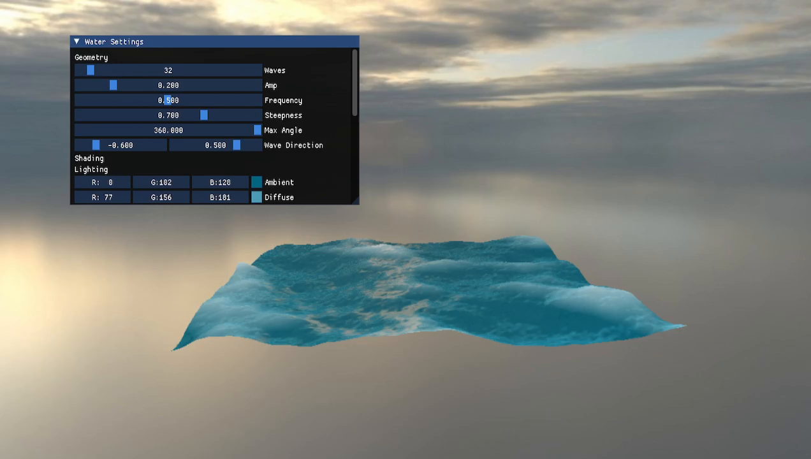
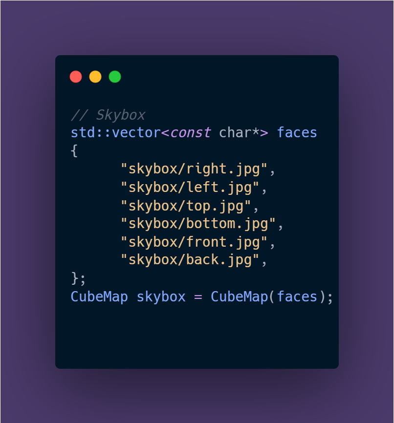

# Water Waves Simulation
This repository contains a demo application as well as the shaders which can be altered to your shader language or environment for waves simulation.

## Features
- Gerstner Waves
- FBM waves behaviour
- Blinn-Phong Shading
- Fresnel & Subsurface Scattering approximation
- Simple Foam Approximation
- Interactive Demo Scene
- Skybox

## What's Missing ?
- FFT & Tessendorf (2001) Simulation Models
- Realistic Foam Simulation
- Tesselation Shaders
- Larger plane model**
- PBR Lighting

**Can be loaded onto demo but will tile and not be visually pleasing to look at compared to an FFT Model of wave simulation.

## How To Use
### 1. Demo

> NOTE: The Renderer Code contains inefficient and unused lines of code which I will clean in the future, this Demo is mainly meant to be used to visualize the waves behaviour through its vertex and fragment shaders.

| Action   | Keys |
|----------|------|
|  FORWARD |  W   |
|  LEFT    |  A   |
|  BACK    |  S   |
|  RIGHT   |  D   |
|  EDIT*   |  R   |
|  QUIT    |  ESC |

**EDIT** action allows you to change the wave variables via an ImGUI window, while the demo is running.

You can change the skybox and its path in code via the WaterDemo.cpp file:

#### Demo Variables

**WaveCount** - The Amount of times (sin and cos) waves are summed to create the current frame's wave geometry and normals, the more waves the more detailed the waves will be, at the expense of more processing on the vertex shader and less FPS overall.  

**Amp** - The *starting* amplitude value of the current frame's wave geometry: in other words how high (and low) the wave geometry can be for the first wave in the sum (since the FBM implementation will reduce the Amplitude the more waves are added). 

**Frequency** - The *starting* frequency value of the current frame's wave geometry : increasing it will increase the amount of cycles per meter , otherwise it will decrease the amount of cycles 

**Steepness** - Controls the *starting* "sharpness" of the wave, a higher steepness will result in sharper crests and wider troughs of the waves while a lower value will decrease that sharpness and wideness.

**Max Angle** - Determines the maximum angle at which the direction of the waves can be randomly rotated, to create a bit more variation in the waves movement.

**Wave Direction** - The Horizontal Direction of the waves.

**Ambient** - Determines the color of the waves when not lit by a diffuse or specular lighting. 
*Note*: Also determines the final color as its value is summed to the Diffuse and Specular colors in the Output Color of the Fragment Shader.

**Diffuse** - Determines the color of the waves when the light hits the surface of the water whose intensity is based on how much the normal and light vector (from fragment to light) are parallel.

**Specular** - Determines the color of the highlights on waves when the reflected light from the surface hits our "eye". 
*See the fragment shader for more details on the implementation.

**Shininess** - Determines how shiny the specular hightlights are. Note that lower values increase the shininess and higher values decrease it due to its implementation in the Fragment Shader

**SpecStrength** - Determines how much intensity the specular highlights should have on the Output Color of the waves

**SpecFresnelIntensity** - Controls how much specular highlights are influenced by the Fresnel effect value.  
Note : Fresnel value increases the more you are looking at a grazing angle to its surface.

**FoamHeight** - Determines the minimum height of the (fake) Foam for it to form. 0 being the lowest point of the waves ; 1 being the highest point.

**Distortion** - Determines how much the light vector will scatter / be distorted / change direction.

**Scale** - Scales the scattering value on the surface

**Power** - Attenuates the scattering value

**Distance** - The max distance where Subsurface scattering will be applied to.

**Strength** - Determines the intensity of the subsurface scattering

**Sun Height** - The height of light.

**Sun Direction** - The horizontal directions of the light.

### 2. Shaders

This subsection will contain how to use this repository in your projects.  
Do note that these shaders would work best on a small body of water, as larger bodies may expose the tiling of the waves geometry making it less visually pleasing.

**Vertex Shader**

In case you have a personal renderer API you may have to change the input layout based on how you will send data to the vertex shader, otherwise if you are using an engine that already handles all of this you do not need to worry about this and only need to use the position vectors of the vertices of your plane mesh.

The logic for the Gerstner waves will remain the same in most shader languages and environment, though you may have to tweak the vertical component which in my case is the **y** component of the position vectors in OpenGL, but could be the **z** component depending on your coordinate system.

Then you may pass the output variables of the vertex shader to the fragment shader and you are good to go with the vertex shader.

**Fragment Shader**

The fragment shader should be ready to use as well no need for changes other than the name of the output variable and declaration of input variables and uniforms depending on the shader language or environment you are using.

Otherwise the light calculations should remain consistent on your end without tweaks needed.  
Note: Be careful when setting a higher frequency factor for the FBM or having a very high wave count as the waves' plane may shrink and even disappear, I will try and find a fix when possible.

**Screen Texture Shader**

You can use this shader in the demo to apply post processing effect if you wish to such as Bloom or a Tonemapper, etc..

## File structure

**WaterDemo.cpp**  
Contains the demo application.

**Shaders/..**  
Contains all the shaders of the demo, including the Gerstner wave shaders.

**src/..**  
Contains all the renderer-related classes and functionalities (OpenGL) needed for the demo to run.

**vendor/..**  
Contains the third-party related libraries and files.

## References
- [GPU Gems 1 - Gerstner Waves](https://developer.nvidia.com/gpugems/gpugems/part-i-natural-effects/chapter-1-effective-water-simulation-physical-models)
- [Fresnel](http://filmicworlds.com/blog/everything-has-fresnel/)
- [FBM](https://iquilezles.org/articles/fbm/)
- [Shadertoy Inspiration](https://www.shadertoy.com/view/3s2BDR)
- [Fake Subsurface Scattering article](https://www.alanzucconi.com/2017/08/30/fast-subsurface-scattering-1/)
- [Fake Subsurface Scattering GDC](https://colinbarrebrisebois.com/2011/03/07/gdc-2011-approximating-translucency-for-a-fast-cheap-and-convincing-subsurface-scattering-look/)